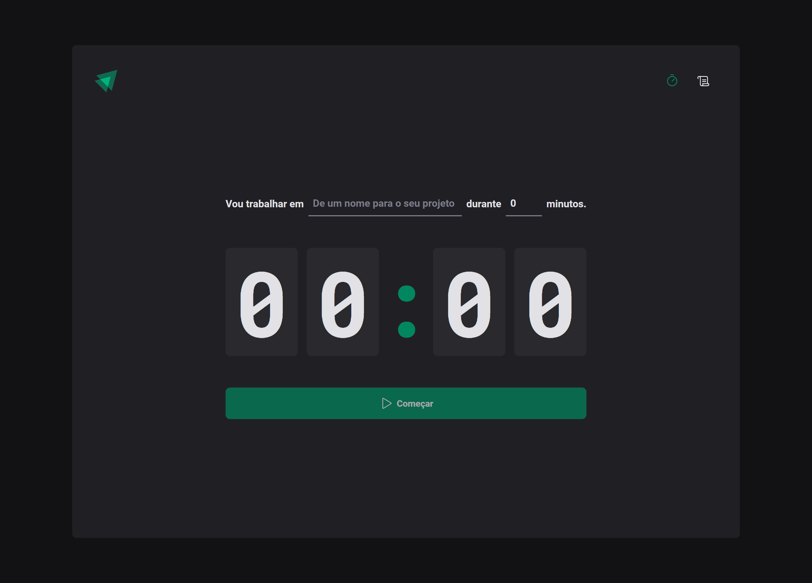

# Timer

<!---Esses são exemplos. Veja https://shields.io para outras pessoas ou para personalizar este conjunto de escudos. Você pode querer incluir dependências, status do projeto e informações de licença aqui--->


<a href="https://timer-sid.netlify.app/" target="_blank">Demo</a>


<br /> 
<br /> 
 
## 💻 Sobre

Este projeto é um timer baseado no método Pomodoro, desenvolvido com a finalidade de ajudar as pessoas a administrar seu tempo de maneira eficiente. Ele foi construído com tecnologias como React e Vite. O timer permite que os usuários estabeleçam períodos de trabalho de 5 a 60 minutos, pulando de 5 em 5 minutos, e períodos de descanso entre eles. A aplicação também inclui recursos como armazenamento de informações do histórico de uso, permitindo que os usuários acompanhem seu progresso e adaptem sua estratégia de administração de tempo. O projeto foi desenvolvido para proporcionar uma experiência de administração de tempo eficiente e personalizada para os usuários.

<br />

## 🖱 Pré-requisitos

Antes de começar, verifique se você atendeu aos seguintes requisitos:

- Você instalou a versão mais recente de `node / npm / yarn`
  <br />

## ☕ Usando o Timer

Para usar o Timer, siga estas etapas:

```
git clone https://github.com/SidneyRoberto9/timer

yarn ou npm i

yarn start ou npm start
```
